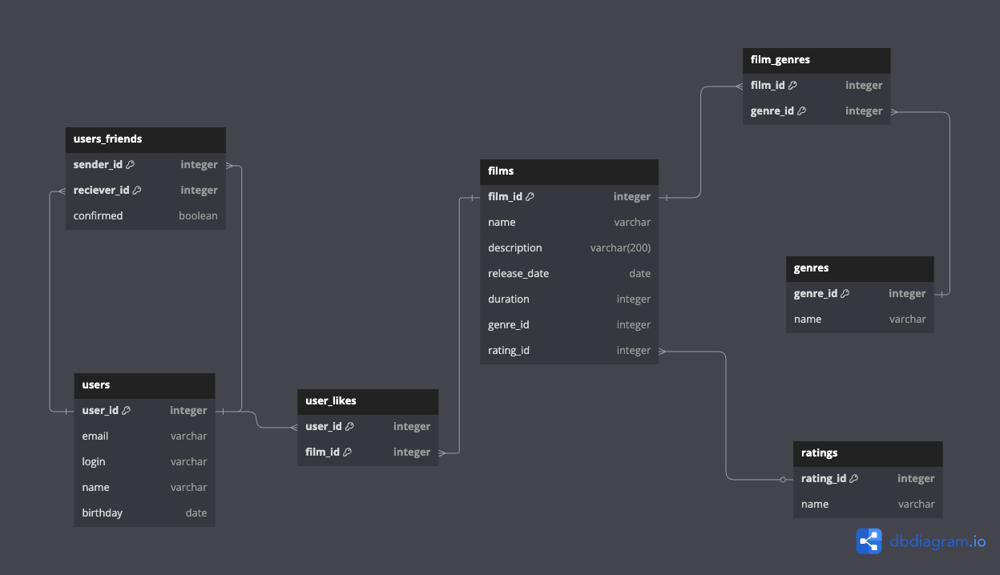

# ER Диаграма проекта

## Таблицы
### users - *таблица пользователей*
- user_id (первичный ключ): уникальное id по которму находится пользователь
- email: почта пользователя
- name: имя пользователя (может быть равно полю login)
- login: логин пользователя
- birthday: дата рождения

### users_friends - *таблица дружб между пользователями*
- sender_id: user_id отправителя
- reciever_id: user_id получателя
- status: отображает статус дружбы (подтвержденная или нет)

### user_likes - *таблица фильмов от пользователей*
- user_id: id пользователя лайкнушего фильм
- film_id: id фильма которому поставлен лайк

### films - *таблица фильмов*
- film_id: уникальный id фильма (первичный ключ)
- name: название
- description: описание
- release_date: дата выхода
- duration: длительность в мин
- genre_id: ключ жанра
- rating_id: ключ рейтинга

### genres - *таблица жанров фильмов*
- genre_id: уникальный id жанра (первичный ключ)
- name: назавние жанра

### ratings - *таблица рейтингов фильмов*
- genre_id: уникальный id рейтинга (первичный ключ)
- name: назавние рейтинга
