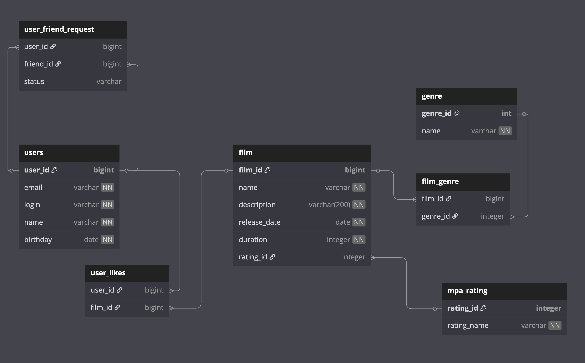

# ER Диаграма проекта


## Таблицы
### users - *таблица пользователей*
- user_id (первичный ключ): уникальное id по которму находится пользователь
- email: почта пользователя
- name: имя пользователя (может быть равно полю login)
- login: логин пользователя
- birthday: дата рождения

### users_friends - *таблица дружб между пользователями*
- sender_id: user_id отправителя (часть ключа)
- receiver_id: user_id получателя (часть ключа)

### user_likes - *таблица фильмов от пользователей*
- user_id: id пользователя лайкнушего фильм (часть ключа)
- film_id: id фильма которому поставлен лайк (часть ключа)

### film - *таблица фильмов*
- film_id: уникальный id фильма (первичный ключ)
- name: название
- description: описание
- release_date: дата выхода
- duration: длительность в мин
- genre_id: ключ жанра
- rating_id: ключ рейтинга

### film_genre - *таблица жанров фильмов (на случай нескольких жанров)*
- film_id: уникальный id фильма (часть ключа)
- genre_id: genre_id: уникальный id жанра (часть ключа)

### genre - *таблица жанров*
- genre_id: уникальный id жанра (первичный ключ)
- name: назавние жанра

### mpa_rating - *таблица рейтингов фильмов*
- rating_id: уникальный id рейтинга (первичный ключ)
- rating_name: назавние рейтинга

## Примеры запросов

### 10 самых популярных фильмов
 ```sql
SELECT f.film_id
   f.name AS film_name,
   COUNT(l.userId) AS likes_count
FROM films AS f
LEFT JOIN user_likes AS l ON f.film_id = l.film_id
GROUP BY f.film_id, f.name
ORDER BY likes_count DESC
LIMIT 10;
```

-- Найти общих друзей между user1 (например, ID=1) и user2 (например, ID=2)
 ```sql
SELECT
   u.*
FROM
   USER_FRIEND_REQUEST ufr1
INNER JOIN
   USER_FRIEND_REQUEST ufr2 ON ufr1.friend_id = ufr2.friend_id
INNER JOIN
   users AS u ON ufr1.friend_id = u.user_id
WHERE
   ufr1.user_id = 1 (user1 ID)
   AND ufr2.user_id = 2 (user2 ID)
```
